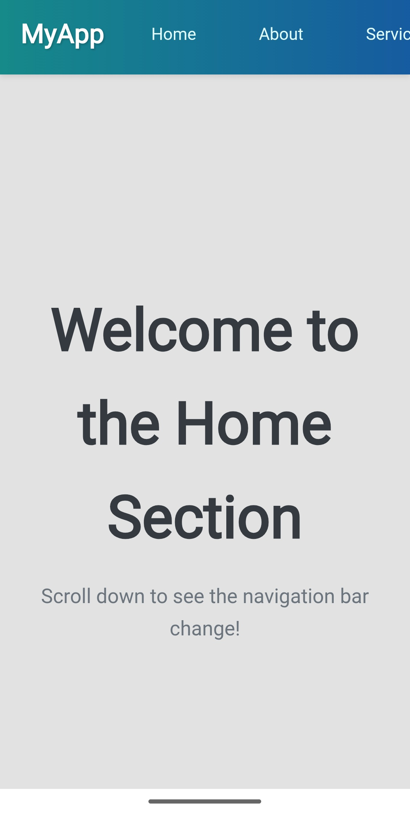

# 🧭 Interactive Navigation Demo Page

A modern interactive navigation web page built using HTML, CSS, and JavaScript.  
This project demonstrates a dynamic navigation bar that responds to user interaction and enhances user experience on single-page layouts.

## 🚀 Live Demo
🔗 https://alakhhawk47.github.io/Interactive-navigation-demo-page/

## 📌 Features
- Interactive navigation highlighting
- Smooth scroll to sections
- Responsive layout
- Modern UI design
- Lightweight and beginner-friendly

## 🛠️ Tech Stack
- HTML5
- CSS3
- JavaScript
- Netlify (Deployment)

## 📂 Project Structure
Interactive-navigation-demo-page
│── index.html
│── style.css
│── script.js
│── assets/ (if present)

## 📷 Screenshot

## 💻 How to Run Locally
1. Clone this repository  
2. Open the project folder  
3. Open `index.html` in browser  

## 🌱 Learning Purpose
This project helps practice JavaScript DOM manipulation, smooth scrolling, and responsive web design fundamentals 

## 👨‍💻 Author
**Alakh Raj Singh**  
B.Tech EC – JSS Academy of Technical Education, 

## GitHub: 
🔗 https://github.com/alakhhawk47
